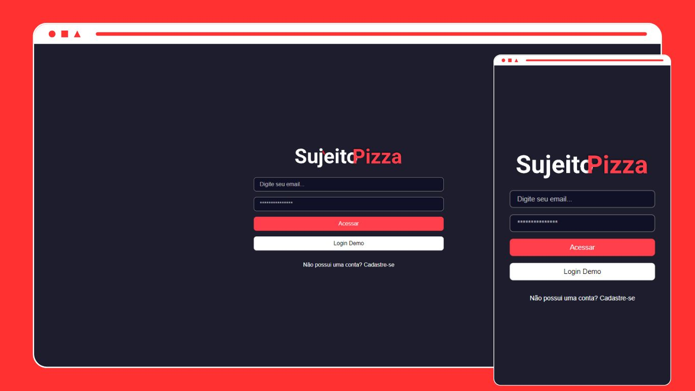
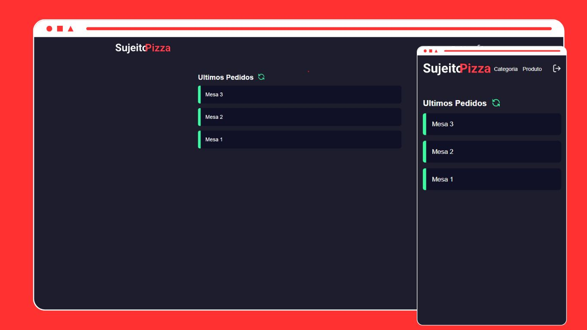
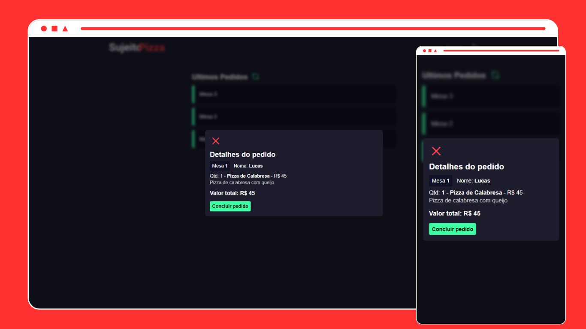
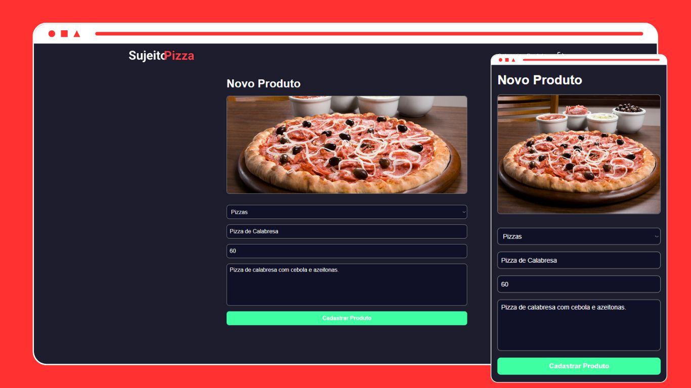
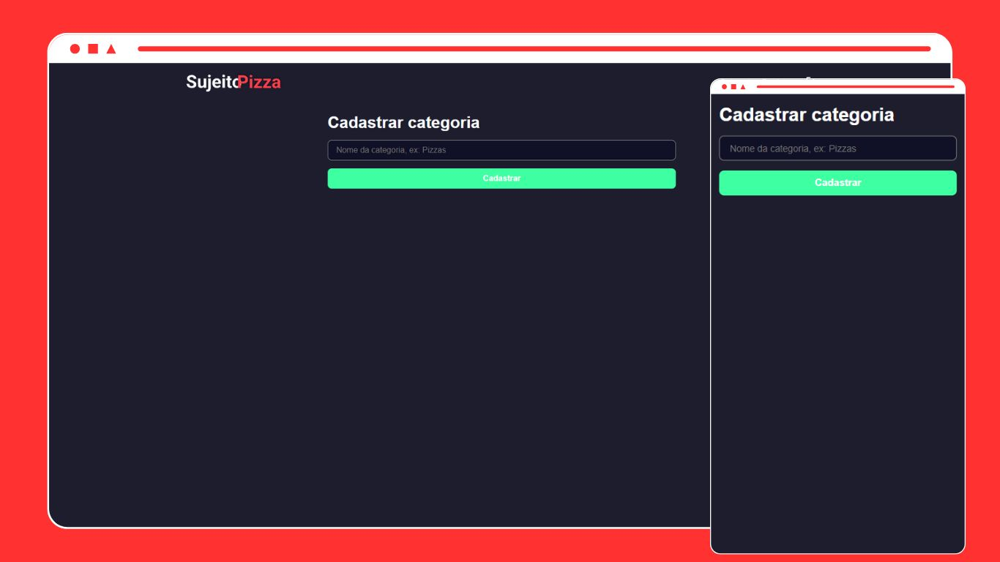

<div style="display: flex; flex-direction: column; text-align: center;">
    <h1>SujeitoPizza - Sistema de Pizzaria</h1>
    
</div>

## Sumário

- [\[DevControle\]](#)
  - [Sumário](#sumário)
  - [Introdução](#introdução)
  - [Tecnologias Usadas](#tecnologias-usadas)
  - [Snapshots](#snapshots)
  - [Ambiente de desenvolvimento](#ambiente-de-desenvolvimento)
  - [Informações Técnicas](#informações-técnicas)
  - [Como Executar o Projeto](#como-executar-o-projeto)
  - [Contato](#contato)

## Introdução

Este é um projeto de sistema de Pizzaria, com objetivo principal de organizar e falicitar o atendimento aos clientes e recebimento de pedidos da cozinha. Este repositório de destina somente ao frontend do projeto e para funcionar é necessário executar o [backend](https://github.com/LucasDoGit/pizzaria-beckend).

## Tecnologias Usadas

&nbsp;
&nbsp;


## Ambiente de desenvolvimento

- Virtual Studio Code - Version 1.97.2
- Node.js - Version 22.11.0

## Informações técnicas

- Utilizado Next 14 com App Router;
- Utilizado TypeScript;
- Requisições feitas com Axios;
- Utilizado regras e padrões do Prettier;
- Utilizado a bibilioteca [cookie-next](https://www.npmjs.com/package/cookies-next) para sessão;
- Utilizado Sass para estilização;
- Utilizado [Sonner](https://www.npmjs.com/package/sonner) para mostrar toasts;

## Snapshots

### Home


### Pedidos recebidos



### Detalhes do pedido



### Cadastro de produtos



### Cadastro de categorias



## Como Executar o Projeto

Para executar o projeto é preciso estar com o ambiente [backend](https://github.com/LucasDoGit/pizzaria-beckend) configurado localmente ou hospedado em alguma plataforma como a vercel.

1. Clone o repositório:

```bash
git clone https://github.com/LucasDoGit/pizzaria-frontend
cd pizzaria-frontend
```

2. Instale as dependências:

```bash
npm install
```

3. Crie o arquivo *.env* na raiz do projeto e configure as variáveis de ambiente, conforme abaixo.

```javascript
NEXT_PUBLIC_API=http:// localhost:3000 ou a url do seu projeto backend
```

4. Execute o comando:

```bash
npm run dev
```

5. Feito! O projeto deve ser iniciado e pode ser acessado usando um navegador web pelo **localhost** ou a **url de hospodagem** do seu projeto.

## Contato

Para obter mais informações, entre em contato comigo em:

- Email: lucas.saiz19@gmail.com
- GitHub: https://github.com/LucasDoGit